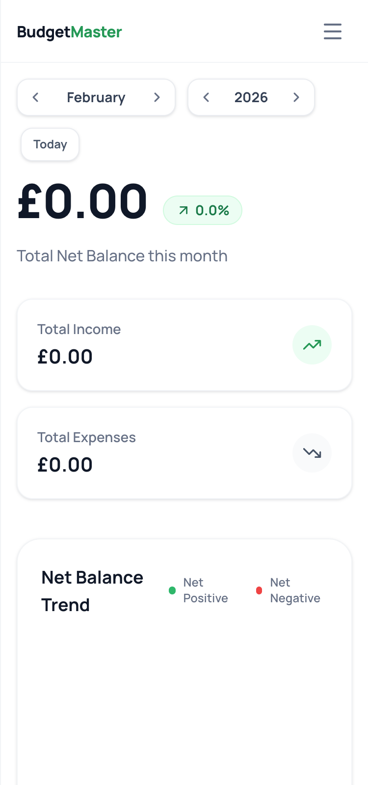
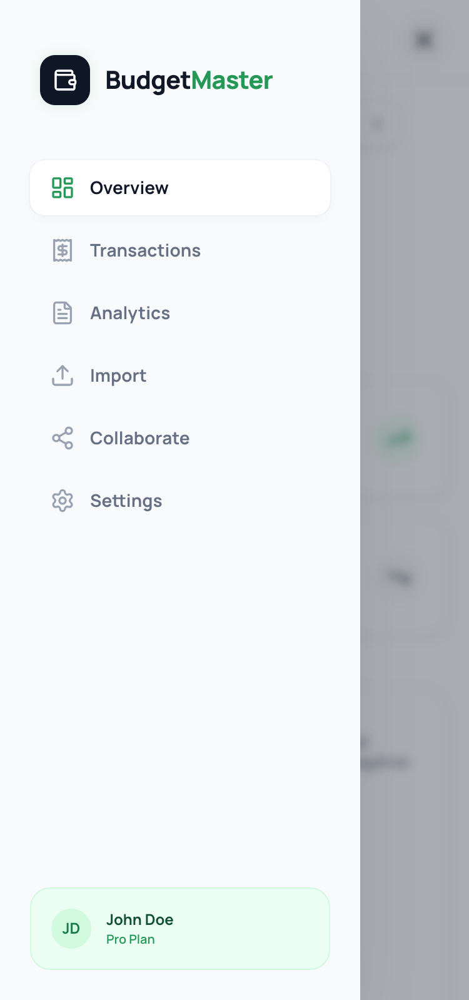
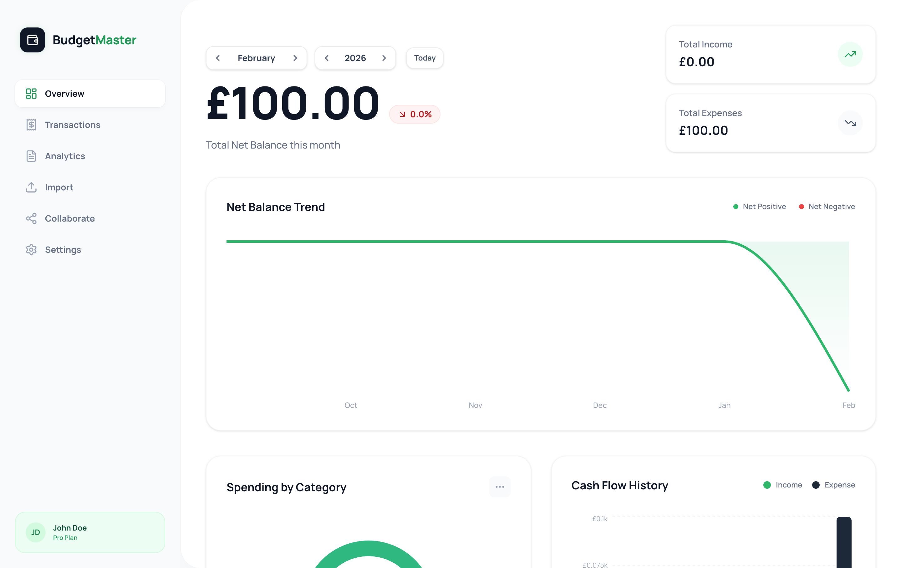
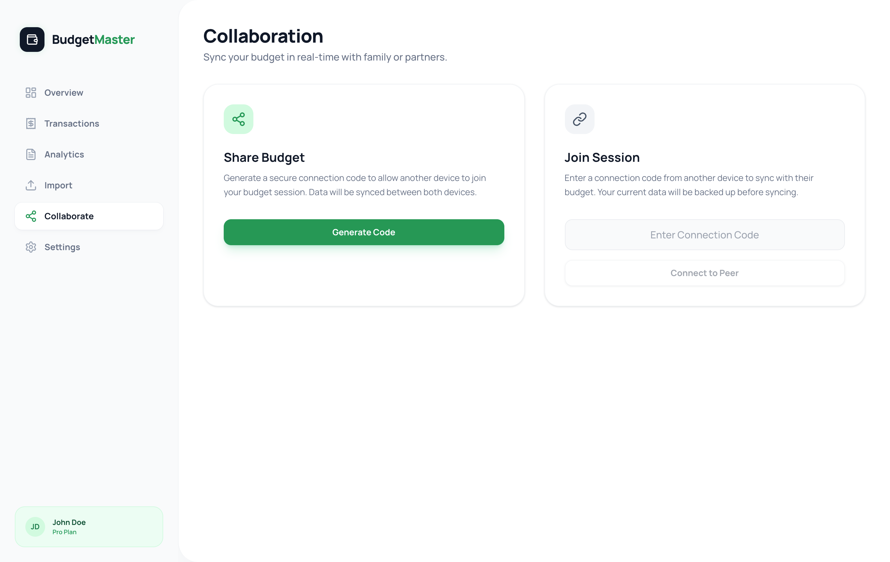

# Budgeting App

A collaborative budgeting application built with React and TypeScript, featuring expense tracking, data import, and real-time collaboration.

## Screenshots

  

  

  

  

## Run Locally

**Prerequisites:** Node.js

1. Install dependencies:
   `npm install`
2. Run the app:
   `npm run dev`
