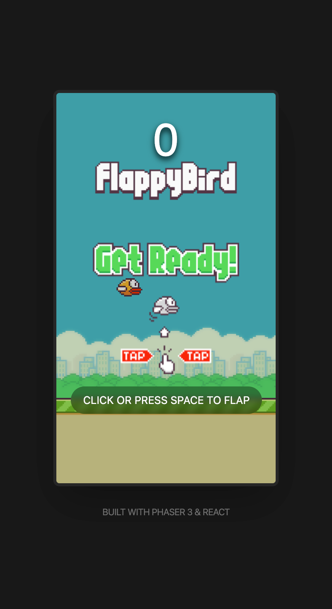

# Flappy Bird



A classic Flappy Bird clone built with Phaser 3 and React. Navigate the bird through pipes by tapping or pressing space to flap!

## How to Run

```bash
# Install dependencies
yarn install

# Start development server
yarn dev
```

Then open your browser to the URL shown in the terminal (typically `http://localhost:3000`).

## Controls

- **Click** or **Press Space** to flap

---

> ⚠️ **Note:** This project was created via vibe coding with AI assistance. Use wisely and review the code before using in production.
